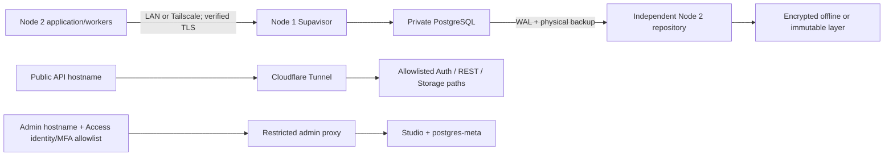

# October 3 migration preparation and future cutover runbook

Status: **NOT executable for production cutover yet.** The isolated stack,
existing migration chain, Auth/MFA/JWT compatibility, private Storage, synthetic
S3 transfer and RLS verifier have passed. Managed-source full parity, CDC,
physical PITR, host capacity and final application E2E remain unproven. This
package must not be called migration-ready until every gate below passes.
Final cutover is not authorized by the master implementation task.

## Candidate and service selection

Use self-hosted Supabase compatibility rather than replacing Auth, PostgREST and
Storage with a simultaneous application rewrite. Exact candidate:
`self-hosted/v0.8.0`, commit `241bb11c0627f2981746d37033f57dbfa81d29b0`.
Every upstream image digest is in `selfhost-versions.json`; the DB reports 17.6.
Digest pinning does not substitute for vulnerability review or upgrade testing.

| Component | Classification | Reason |
| --- | --- | --- |
| PostgreSQL | REQUIRED | Application data, functions, grants and RLS |
| Auth | REQUIRED | Passwords, sessions, email verification, OAuth, MFA |
| PostgREST | REQUIRED | Application uses Supabase Data API throughout |
| Storage | REQUIRED | Provider-backed builder assets and signed URLs |
| Envoy | REQUIRED | Opaque key translation and public API routing |
| Supavisor | REQUIRED candidate | Private pooled runtime connections; test mode compatibility |
| Studio + postgres-meta | REQUIRED for requested admin surface | Must be protected by separate Access policy and upstream routing |
| imgproxy | REPLACE/REMOVE candidate | Included as upstream Storage dependency; transformation disabled; Madar has image rendering. Remove only after dependency tests. |
| Realtime | UNUSED in inspected application paths | Source has a managed publication but no active slots; do not enable a service just because a publication exists |
| Edge Functions | UNUSED in inspected source | No checked-in functions/call sites requiring activation found |
| GraphQL, pg_net, pg_cron | UNUSED in inspected migrations | Do not introduce during migration |
| Vault | REQUIRED parity review | Managed extension present; verify whether it holds active dependencies before omitting |

Managed catalog inventory: PostgreSQL 17.6; extensions pg_stat_statements 1.11,
pgcrypto 1.3, plpgsql 1.0, supabase_vault 0.3.1, uuid-ossp 1.1. Existing source
contains no explicit cron/pg_net jobs. Full managed service-dashboard inventory
has not been performed; source absence alone does not prove provider-side absence.

## Hardware and network

Node 1: i3-6100, 4 logical CPUs, 7.2 GiB RAM, Mailcow active. Backup filesystem
/dev/sdc1 ext4 mounted /srv/data2, approximately 869 GiB available at attestation.
Privileged SMART, fsync and workload/capacity assessment blocked by missing sudo.
No primary placement is approved. Never use /srv/data1 or modify /srv/data2/docker.

Conditional proposed paths, only after disk and capacity acceptance:

- `/srv/data2/madar-data/postgres` — PGDATA, private owner and no public mount.
- `/srv/data2/madar-data/storage` — Storage data, independently backed up.
- `/srv/data2/madar-data/state` — platform service state.
- `/srv/data2/madar-data/wal-staging` — bounded archive staging, not the only WAL copy.
- Existing `/srv/data2/madar-backups` remains the current backup repository. If
  Node 1 hosts PostgreSQL, this stops being an off-host database backup.
- Future true off-host repository on Node 2 requires its own capacity and disk
  acceptance; add a separately verified encrypted offline/immutable copy.



Do not expose TCP 5432/6543 publicly. Separate runtime, migration, backup,
replication and admin identities. Transaction pooling is unsuitable for
session-scoped advisory locks and similar features without compatibility proof.
Migrations, dump/restore and replication need the private direct/session path.
Public host routes must deny Studio, metadata, management and debug paths, even
when clients guess them. Access identity checks must occur before the admin
upstream; no direct origin bypass. Studio basic authentication is only an extra
layer. Keep emergency Tailscale/SSH + psql access.

## Rebuild the isolated candidate

Operator prerequisites: Git, local Docker/Compose, Python with PyYAML, OpenSSL;
Node key-generation fallback is digest-pinned. Use non-production secrets only.

```bash
git clone --filter=blob:none --depth 1 --branch self-hosted/v0.8.0 --sparse https://github.com/supabase/supabase.git /home/madar/supabase-rehearsal-source
git -C /home/madar/supabase-rehearsal-source sparse-checkout set docker
python3 web/scripts/prepare_selfhost_rehearsal.py \
  --upstream /home/madar/supabase-rehearsal-source \
  --output /home/madar/migration-rehearsal/selfhost-rehearsal \
  --lock docs/master-implementation-2026-09-08/selfhost-versions.json
```

The preparer refuses existing targets, production roots, symlink parents,
unsafe mounts, unpinned images and wrong upstream identity. It copies only exact
tracked upstream blobs, generates private synthetic credentials without output,
uses capped services, and validates Compose without starting services.
It deliberately excludes inherited provider credentials from subprocesses.

Ports 55431 (API), 55432 (session pool), 55433 (transaction pool), 55434 (direct
PostgreSQL) bind only 127.0.0.1. Starting a prepared stack must likewise use a
clean shell environment so inherited variables cannot override its private
`.env`. Existing proof was synthetic and did not receive production browser traffic.
Do not print `docker compose config` without `--quiet`, container environments,
or generated credentials. Do not run production data through the synthetic
signup/email-autoconfirm configuration.

Evidence under `/home/madar/master-implementation-20260908` includes schema
rehearsal results and scripts for Auth/API smoke and rclone transfer. These were run against the
exact candidate and remain evidence scripts, not a complete governed migration
executor. A full migration/parity/CDC executor remains required.

## Storage and Auth gates

Storage migration uses S3/rclone with matching bucket definitions. Never copy
managed downloads directly into Storage's filesystem. Capture source and target
bucket config, object names, counts, sizes and SHA-256; verify active-reference
coverage and signed URLs. Use `rclone copy`, not an unreviewed destructive sync.
The synthetic rehearsal showed S3 signatures must use the configured public URL;
calling the internal alias while STORAGE_PUBLIC_URL named loopback failed.
The corrected loopback URL passed copy, download-based check and SHA-256.

Auth migration must include users, hashed passwords, identities, verification,
metadata, MFA and required session records. Decide explicitly between temporarily
preserving compatible signing material and requiring reauthentication after
rotation. Prove legacy HS256 and new ES256 compatibility, refresh, MFA and all
OAuth callback URLs. Do not copy private/symmetric JWKs into public JWKS or Git.
Current production credentials and sessions have not been changed.

## Future cutover state machine

Every transition requires recorded evidence. No skipping or fabricated state.

1. Fresh complete logical backup and off-host verification.
2. Successful physical backup/WAL/PITR rehearsal on the exact platform build.
3. Exact tested platform images, configuration and capacity acceptance.
4. Initialize guarded target; identity display excludes secrets.
5. Export/import approved roles, schema and data in supported order.
6. Begin explicitly allowlisted one-way CDC; source remains sole writer.
7. Validate replica identity, role/publication/subscription and slot health.
8. Initial S3 object copy and bucket configuration verification.
9. Auth parity, identities, password/login/MFA checks.
10. Database functions/triggers/extensions/grants/RLS/count/hash parity.
11. Monitor lag and retained WAL with bounded disk budgets.
12. Enter the reviewed application write fence.
13. Drain HTTP and all worker writes; reject new jobs/checkouts.
14. Drain replication and prove zero remaining lag.
15. Synchronize every sequence/identity with collision-safe next values.
16. Final database parity and business invariants.
17. Final object/bucket/hash/active-reference parity.
18. Final Auth checks and approved session strategy.
19. Separately authorized protected configuration change.
20. Exact-SHA deploy through existing control plane.
21. Stable and active readiness, exact live/controller/source identities.
22. Cross-tenant and role isolation.
23. Login, refresh, MFA and OAuth smoke.
24. Private/public storage and signed URL smoke.
25. All worker and queue health.
26. Controlled business smoke: entitlements, orders, inventory and billing.
27. Lift write fence only after all preceding gates pass.
28. Observe errors, latency, queues, WAL/archive, backups and disk.
29. Keep managed source fenced and recoverable for the approved rollback window.
30. Retire managed project only under separate approval after recovery and
    rollback-window acceptance; rotate temporary migration credentials.

Rollback triggers: identity mismatch, any failed security/parity/recovery gate,
unexplained financial/inventory difference, missing active object, auth/MFA
failure, unavailable critical worker, stalled CDC or unsafe disk/WAL growth.
Before target writes, revert through the governed config/exact-SHA path to the
fenced source. After target writes, never point at a stale source: re-fence,
preserve target writes and execute an explicitly reviewed reverse-transfer or
forward-repair plan. No generic active-active or last-write-wins recovery.

PITR, archive lag, slot inactivity, retained WAL, disk pressure, object parity,
Auth parity, last full verification and true off-host freshness must have alerts.
Current logical backup and provider-object recovery remain enabled throughout.
